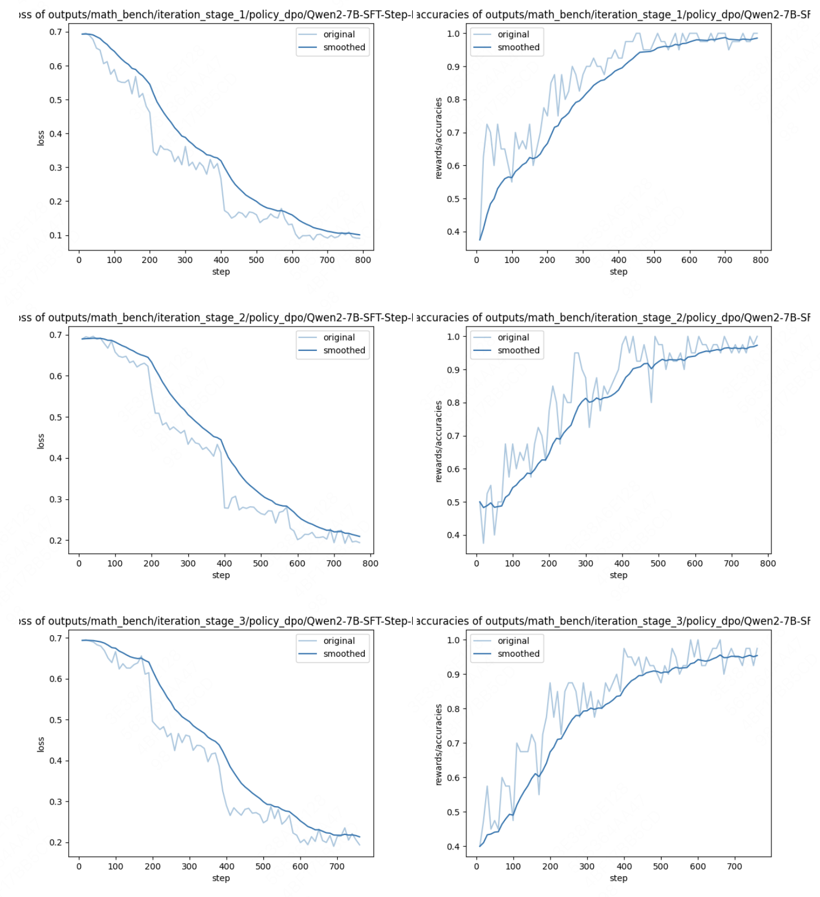

This code is implemented for the paper "[Self-evolutionary Large Language Models through Uncertainty-Enhanced Preferece Optimization](https://arxiv.org/abs/2409.11212)", which is published at AAAI 2025.


### data

- ultrachat200k：https://huggingface.co/datasets/HuggingFaceH4/ultrachat_200k
- Eval Instruct：https://huggingface.co/datasets/WizardLMTeam/WizardLM_evol_instruct_V2_196k
- ShareGPT：https://huggingface.co/datasets/shibing624/sharegpt_gpt4
- ultralfeedback
- math-step-dpo-10k

### data process
> data/data_preprocess.ipynb

evaluation benchmark:
- alpaca eval 2.0
- mt-bench
- gsm8k
- math

experiment setups and script is shown in ```examples/```.
- llm_bench: perform upo on ultrafeedback + prompt.
- math_bench: perform stepupo on math-stepdpo-10k.
- evalution: evaluting llm policy on alpaca-eval 2.0, mt-bench, gsm8k and math.


### The procedure

suppose use zephyr-7b to train on universal NLP task.
- step1: bash llm_bench/init_stage/run_dpo.sh, llm_bench/init_stage/run_rm.sh, llm_bench/init_stage/run_es.sh.
- step2: bash llm_bench/iteration_stage_1/run_sample_reward_and_estimate.sh
- step3: bash llm_bench/run_dpo.sh # the output lora is the trained policy
- step4: bash llm_bench/iteration_stage_2/run_sample_reward_and_estimate.sh
- step5: bash llm_bench/run_dpo.sh # the output lora is the trained policy
- step6: bash llm_bench/iteration_stage_3/run_sample_reward_and_estimate.sh
- step7: bash llm_bench/run_dpo.sh # the output lora is the trained policy

### Main results




### Citation
```
@article{wang2024self,
  title={Self-Evolutionary Large Language Models through Uncertainty-Enhanced Preference Optimization},
  author={Wang, Jianing and Zhou, Yang and Zhang, Xiaocheng and Bao, Mengjiao and Yan, Peng},
  journal={arXiv preprint arXiv:2409.11212},
  year={2024}
}
```

---

